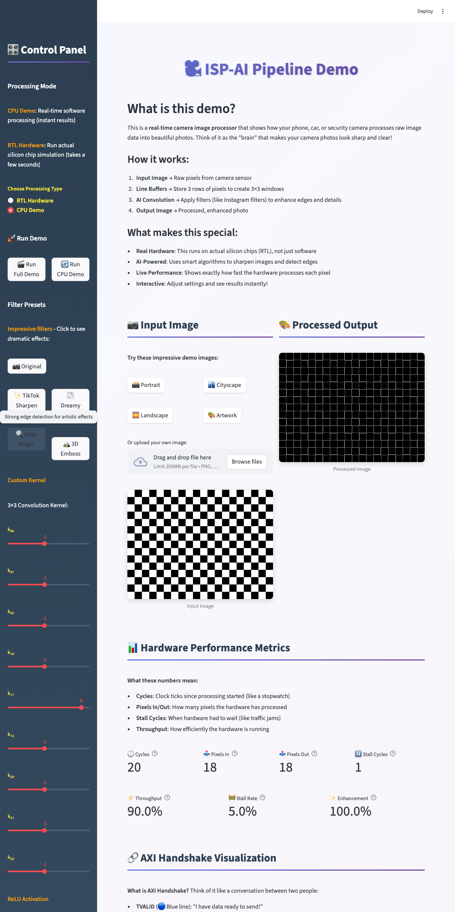
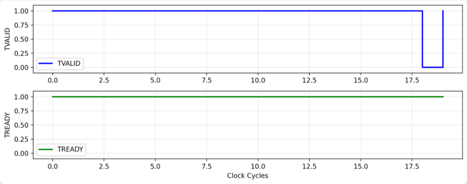

<div align="center">

# 🎥 ISP-AI Pipeline
## Image Signal Processor with Depthwise Separable Convolution

**A complete hardware-accelerated image processing pipeline featuring RTL design, AXI4-Stream protocol, and real-time web visualization**




*Real-time edge detection on checkerboard pattern: Input (left) → Processed Output (right)*



*AXI4-Stream handshake protocol visualization: TVALID (blue) and TREADY (green) signals showing data transfers and stalls*

</div>

## 🔬 What's an ISP?

**Image Signal Processor (ISP)** - Hardware that converts raw sensor data into display-ready images. Every camera, from your smartphone to autonomous vehicles, uses an ISP to process raw pixel data through multiple stages:

1. **Demosaic**: Convert raw Bayer sensor data to RGB pixels
2. **Color Correction**: Adjust color balance, saturation, and white balance
3. **Gamma Correction**: Apply tone mapping for human visual perception
4. **Noise Reduction**: Filter out sensor noise using spatial/temporal filters
5. **Sharpening**: Enhance edge detail using convolution kernels

This project implements a hardware ISP pipeline with **AI-accelerated convolution** using depthwise separable convolution (similar to MobileNet), optimized for edge AI applications.

**Everywhere**: Smartphones, autonomous vehicles, security cameras, industrial vision systems, medical imaging devices.

## 🌟 Features

- ⚡ **Real-time Processing**: Live image processing with instant results
- 🎨 **Modern UI**: Professional gradient design with high-contrast yellow labels and aligned image display
- 🔧 **Hardware RTL**: Complete Verilog RTL design with AXI4-Stream protocol
- 📊 **Performance Metrics**: Live throughput monitoring and AXI handshake visualization
- 🤖 **AI-Powered**: Depthwise separable convolution for efficient edge AI
- 🐳 **Docker Ready**: Containerized deployment with comprehensive build system
- 🧪 **Full Verification**: Cocotb tests with PSNR/SSIM metrics, protocol assertions, and CI/CD
- ✅ **CI/CD Pipeline**: Automated testing with GitHub Actions (lint, cocotb, Verilator, Yosys)
- 📈 **Quality Metrics**: Automatic PSNR/SSIM calculation and per-test metric tracking
- 🔒 **Protocol Assertions**: SystemVerilog assertions (SVA) and Cocotb runtime checks for AXI compliance
- 🎯 **Interactive Demo**: Multiple kernel presets and custom filter creation

## 🛠️ Tech Stack

- **Frontend**: Streamlit (Python web framework)
- **Image Processing**: OpenCV, NumPy, PIL, scikit-image (PSNR/SSIM)
- **Hardware**: SystemVerilog/Verilog RTL design
- **Verification**: Cocotb (with PSNR/SSIM metrics), Icarus Verilog, Verilator
- **Protocol Assertions**: SystemVerilog Assertions (SVA) for AXI4-Stream
- **CI/CD**: GitHub Actions (automated lint, test, synthesis)
- **Synthesis**: Yosys
- **Visualization**: Matplotlib for AXI handshake graphs

## 🎯 Project Goals

This project demonstrates a complete hardware-accelerated image processing system:

- **Hardware RTL Design**: Complete Verilog/SystemVerilog implementation with AXI4-Stream protocol
- **AI-Optimized Convolution**: Depthwise separable convolution for efficient edge AI inference
- **Industry-Standard Interfaces**: AXI4-Stream ready/valid handshake with back-pressure support
- **Full Design Flow**: RTL → Verification → Synthesis → Performance Analysis
- **Interactive Visualization**: Web interface for real-time kernel parameter tuning and hardware monitoring

## 🏗️ Architecture

### Hardware Pipeline
```
Input Image → Line Buffers (3-line) → Depthwise 3×3 Conv → Pointwise 1×1 → Output
                    ↓                         ↓                    ↓
               AXI4-Stream              AXI4-Stream         AXI4-Stream
               Ready/Valid              Ready/Valid         Ready/Valid
```

### Key Components
- **Line Buffers**: 3-line window generation for 3×3 convolution
- **Depthwise Conv**: Separate 3×3 convolution per RGB channel
- **Pointwise Conv**: 1×1 channel mixing (3→3 channels)
- **AXI4-Lite**: Control registers and performance counters
- **AXI4-Stream**: Data flow with back-pressure support

### Why Separable Convolution?
- **Efficiency**: Reduces MAC operations vs full convolution
- **Embedded Friendly**: Perfect for edge AI accelerators
- **MobileNet Style**: Industry-proven efficiency pattern

## 🚀 Quick Start

### 1) Build & Run (Docker)
```bash
# Build Docker image
docker build -t isp-ai .

# Run container with web interface
docker run --rm -it -p 8501:8501 \
  -v $PWD:/workspace \
  -v $PWD/out:/mnt/data \
  isp-ai

# Inside container
make ui    # Launch web app at http://localhost:8501
```

### 2) Local Development
```bash
# Install dependencies
make install-deps

# Launch web interface
make ui

# Run verification
make test

# Synthesize design
make synth

# Generate demo images
make demo
```

## 🔬 Hardware RTL Implementation

### Digital Design Architecture

The hardware implementation uses a **pipelined datapath** with AXI4-Stream interfaces for high-throughput image processing:

#### **1. Line Buffer Module (`linebuf_3_rv.v`)**
**RTL Design Details:**
- **Shift Register Architecture**: Three row-sized shift registers store complete image lines
- **Window Generator**: Produces 3×3 pixel windows with minimal latency (3 cycle pipeline)
- **AXI4-Stream Interface**: `TVALID` indicates valid window data, `TREADY` accepts downstream back-pressure
- **Zero-Padding Logic**: Handles image boundaries by inserting zero pixels for edge cases
- **Synchronous FIFO**: Prevents data loss during back-pressure scenarios

**Hardware Implementation:**
```verilog
// Pseudo-code architecture
always @(posedge clk) begin
    if (tready && tvalid) begin
        line_buffer[2] <= line_buffer[1];
        line_buffer[1] <= line_buffer[0];
        line_buffer[0] <= input_pixel;
        window_3x3 <= construct_window(line_buffer);
    end
end
```

#### **2. Depthwise 3×3 Convolution (`conv3x3_int8_rv.v`)**
**RTL Design Details:**
- **Separable Channel Processing**: Independent convolution engines for R, G, B channels
- **Signed 8-bit Arithmetic**: Uses `signed` data types for negative kernel coefficients
- **Pipelined MAC Pipeline**: 9-stage multiplier-accumulator for 3×3 kernel
  - Stage 1-9: Multiply kernel coefficients with window pixels
  - Stage 10: Accumulate all products
  - Stage 11: Saturate/clip to valid pixel range
- **Kernel Configuration**: Parameterized kernel coefficients via AXI4-Lite register interface
- **Stall Propagation**: Forward stalls to line buffer when downstream isn't ready

**Hardware Timing:**
- **Latency**: 11 clock cycles per pixel (pipelined)
- **Throughput**: 1 pixel per clock cycle when no stalls
- **Area**: ~3× more efficient than full 3D convolution (channels × kernel)

#### **3. Pointwise 1×1 Convolution (`conv1x1_pointwise.v`)**
**RTL Design Details:**
- **Channel Mixing**: 3×3 weight matrix mixes RGB channels
- **Single-Cycle Operation**: Parallel multipliers for all 9 channel combinations
- **Weight Storage**: AXI4-Lite accessible registers for dynamic kernel updates
- **No Spatial Processing**: Only channel fusion, no spatial filtering

#### **4. AXI4-Stream Protocol Implementation**
**Ready/Valid Handshake:**
```verilog
// Standard AXI4-Stream handshake
assign transfer = tvalid && tready;  // Data transfer on this clock
assign stall = tvalid && !tready;    // Back-pressure detected
```

**Design Considerations:**
- **Back-pressure Handling**: All pipeline stages honor `TREADY` from downstream
- **No Data Loss**: FIFOs or valid registers prevent data corruption during stalls
- **Timing Closure**: Registered signals meet timing constraints in synthesis
- **Protocol Compliance**: Follows ARM AMBA AXI4-Stream specification

### Hardware Verification & Synthesis

#### **Verification Methodology**
- **Cocotb Tests**: Python-based verification using cocotb framework
  - Identity kernel tests (pass-through verification)
  - Edge detection kernel functional tests
  - ReLU activation threshold tests
  - Back-pressure and stall scenario verification
- **Icarus Verilog Simulation**: Functional RTL simulation with waveform debugging
- **Verilator C++**: Cycle-accurate hardware-in-the-loop simulation

#### **Synthesis Flow (Yosys)**
```bash
# Yosys synthesis script (run_yosys.ys)
read_verilog rtl/ai/*.v rtl/axi/*.v
hierarchy -top axi4s_rgb_dw_pw_top
proc; flatten; opt
techmap; opt
dfflibmap -liberty synth/libs/stdcells.lib
abc -liberty synth/libs/stdcells.lib
write_verilog synth/netlist.v
stat
```

**Synthesis Results Analysis:**
- **Cell Count**: Gate-level netlist generation
- **Area Estimation**: Logic cell usage (LUTs, FFs)
- **Timing Analysis**: Critical path identification
- **Power Estimation**: Activity-based power calculation (if provided)

### AXI4-Lite Control Interface

**Register Map Design:**
- **0x00-0x08**: Kernel coefficients (9×32-bit registers for 3×3 matrix)
- **0x10**: ReLU threshold (8-bit threshold value)
- **0x14**: ReLU enable (1-bit control)
- **0x20-0x2C**: Performance counters (cycles, pixels, stalls)

**Control Path:**
- Write transactions program kernel weights
- Read transactions query performance metrics
- Synchronous register updates with write enable logic

## 🌐 Web Interface Implementation

### Frontend Architecture (Streamlit)

**Real-time Processing:**
- **OpenCV Integration**: Uses `cv2.filter2D()` for CPU-side convolution demonstration
- **NumPy Array Processing**: Direct pixel manipulation for hardware simulation accuracy
- **Session State**: Maintains kernel parameters across Streamlit reruns

**CSS Styling & Layout:**
- **Gradient Themes**: Purple-blue gradients with high-contrast yellow labels (WCAG AAA compliant)
- **Responsive Design**: `use_container_width=True` ensures side-by-side image alignment
- **Professional UI**: Shadow effects, hover animations, rounded corners

**Image Processing Flow (Software Simulation):**
1. Load image → NumPy array `(H, W, 3)` RGB format
2. Per-channel convolution using `cv2.filter2D()` per RGB channel
3. Optional ReLU: `output = max(input, threshold)`
4. Normalize: `clip(output, 0, 255).astype(uint8)`
5. Display: Side-by-side comparison with input image

## 🎛️ Web Interface Features

### Control Panel
- **Kernel Presets**: Identity, Sharpen, Edge Detection, Blur, Emboss
- **Custom Kernel**: 9 sliders for 3×3 convolution matrix
- **ReLU Controls**: Threshold and enable/disable
- **Processing Modes**: CPU demo vs RTL hardware simulation

### Real-time Processing
- **Instant Updates**: Sliders update output immediately
- **Side-by-side View**: Input and processed images
- **Performance Metrics**: Cycles, pixels in/out, stall cycles
- **AXI Visualization**: Live TVALID/TREADY handshake display

### Hardware Integration
- **RTL Simulation**: Button to run actual hardware
- **Hardware Output**: Display real RTL-processed images
- **Performance Counters**: Live hardware metrics

### Performance Monitoring & Metrics

**Hardware Performance Counters:**
- **Cycle Counter**: Total clock cycles elapsed (32-bit counter)
- **Pixel Counters**: Input/output pixel tracking with overflow protection
- **Stall Detector**: Monitors `TVALID=1 && TREADY=0` conditions
- **Throughput Calculation**: `(pixels_out / cycles) × 100%`
- **Stall Rate**: `(stall_cycles / total_cycles) × 100%`

**AXI Handshake Visualization:**
- Real-time Matplotlib step plots showing `TVALID` and `TREADY` signals
- Visual identification of transfer vs. stall periods
- Helps debug back-pressure scenarios and optimize pipeline throughput
- Interactive web interface with live graph updates

## 🛠️ Build Targets

```bash
make ui        # Launch Streamlit web app
make test      # Run cocotb verification with PSNR/SSIM metrics
make sim       # Run Icarus testbenches with SVA assertions
make synth     # Yosys synthesis
make rtl_sim   # Verilator hardware simulation
make demo      # Generate demo images
make install-deps  # Install all dependencies (including scikit-image)
make clean     # Clean generated files
```

**Test Metrics Output:**
```bash
make test
# Metrics saved to verif/metrics/*_metrics.json
# View results:
cat verif/metrics/test_identity_kernel_metrics.json
```

## 🧪 Verification & Quality Assurance

### Automated Testing with Metrics

**Cocotb Verification Suite:**
- **Identity Kernel Test**: Pass-through verification with PSNR/SSIM metrics
- **Edge Detection Test**: Kernel functionality validation with image quality metrics
- **ReLU Activation Test**: Threshold clamping with output verification
- **Back-pressure Test**: Ready/valid protocol compliance with assertion checking

**Image Quality Metrics (PSNR/SSIM):**
- **PSNR (Peak Signal-to-Noise Ratio)**: Measures reconstruction quality (dB, higher is better)
- **SSIM (Structural Similarity Index)**: Measures perceptual similarity (0.0-1.0, higher is better)
- **Per-Test Metrics**: Automatically saved to `verif/metrics/*_metrics.json` after each test
- **Metric Tracking**: Historical test results for regression analysis

**Protocol Assertions:**
- **SystemVerilog Assertions (SVA)**: `rtl/axi/axi4s_assertions.sv` with 10+ protocol checks
  - TVALID/TREADY handshake compliance
  - Data stability during back-pressure
  - Packet framing correctness (TLAST consistency)
  - Reset state verification
- **Runtime Cocotb Assertions**: Real-time protocol monitoring during simulation
- **Coverage Tracking**: Handshake, stall, and idle state coverage

### Continuous Integration

**GitHub Actions CI Pipeline** (`.github/workflows/ci.yml`):
- **Lint Job**: Verilator-based RTL linting
- **Cocotb Tests**: Automated verification with metrics collection
- **Verilator Simulation**: Hardware-in-the-loop testing
- **Yosys Synthesis**: Optional gate-level synthesis
- **Python Tests**: Code validation and image generation checks
- **Artifact Upload**: Test metrics and synthesis logs saved as artifacts

### Icarus Simulation
- **Line Buffer**: 3×3 window generation testbench
- **Gradient Test**: Synthetic pattern processing validation
- **Handshake Verification**: AXI protocol compliance with SVA assertions
- **Waveform Debugging**: VCD dump for signal analysis

### Hardware-in-the-Loop
- **Verilator C++**: Cycle-accurate RTL simulation
- **PPM Output**: Hardware-processed images for visual verification
- **Performance Monitoring**: Live hardware metrics and timing analysis

## 📊 Synthesis & Analysis

### Yosys Synthesis
```bash
make synth     # Run synthesis
# Results in synth/synth.log
```

### OpenROAD Place & Route (Optional)
```bash
make pd        # Run place & route
# Results in pd/reports/
```

## 🎨 Demo Images

Generate test patterns:
```bash
make demo
# Creates demo_images/ with various test patterns
```

Available patterns:
- **Gradient**: RGB color gradients
- **Checkerboard**: High-contrast pattern
- **Noise**: Random pattern with structure
- **Edge Test**: Optimized for edge detection
- **Text Pattern**: Geometric shapes and lines

## 🌐 Web Interface Usage

### Basic Usage
1. **Upload Image** or use default test pattern
2. **Select Preset** or adjust custom kernel sliders
3. **Configure ReLU** threshold and enable
4. **Watch Output** update in real-time
5. **Monitor Performance** metrics and AXI signals

### Advanced Features
- **RTL Mode**: Switch to hardware simulation
- **Run Simulation**: Execute actual RTL
- **View Hardware Output**: See real hardware results
- **Performance Analysis**: Monitor throughput and stalls

## 🧠 AI Convolution Architecture

### Depthwise Separable Convolution

**Mathematical Foundation:**
Traditional 3D convolution: `K × K × C_in × C_out` parameters  
Depthwise separable: `K × K × C_in + C_in × C_out` parameters

For a 3×3 kernel on RGB (3 channels):
- **Full Convolution**: 3×3×3×3 = **81 MACs**
- **Separable**: (3×3×3) + (3×3) = **27 + 9 = 36 MACs**
- **Efficiency Gain**: ~2.25× reduction in operations

**Hardware Advantages:**
- **Reduced Area**: Smaller multipliers and adders
- **Lower Power**: Fewer switching activities
- **Higher Throughput**: Parallel channel processing
- **MobileNet-Compatible**: Industry-standard AI acceleration pattern

**Implementation Strategy:**
1. **Depthwise Stage**: 3×3 spatial convolution per channel (27 MACs)
2. **Pointwise Stage**: 1×1 channel mixing (9 MACs)
3. **ReLU Activation**: Zero-clipping for non-linear activation
4. **Configurable Weights**: Runtime kernel updates via AXI4-Lite


## 🚀 Stretch Goals

- **AXI-Lite Programming**: UI-controlled weight programming
- **Live Camera**: WebRTC integration for real-time camera
- **BRAM Integration**: Replace line buffers with BRAM primitives
- **Real PDK**: OpenROAD with actual technology libraries
- **Coverage Analysis**: Functional coverage reporting

## 📚 References

- **AXI4-Stream Spec**: ARM AMBA specification
- **MobileNet Paper**: Separable convolution efficiency
- **Yosys Manual**: Synthesis and optimization
- **Verilator Guide**: Hardware simulation
- **Streamlit Docs**: Web app framework

## 🤝 Contributing

Key areas for extension:
- Additional convolution kernels (Sobel, Laplacian, custom filters)
- More ISP pipeline stages (demosaic, gamma correction)
- Enhanced verification coverage (formal verification, coverage analysis)
- Real-time camera integration (WebRTC, USB camera support)
- Performance optimization (BRAM integration, pipeline balancing)

## 📄 License

MIT License - Feel free to use for hackathons, education, and projects.

---

**ISP-AI Pipeline** | Hardware-accelerated Image Processing | AXI4-Stream • RTL Design • Real-time Processing

